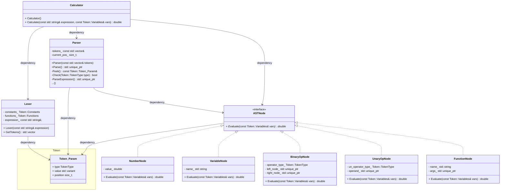

# Calculator

Реализация калькулятора на с++

## Структура проекта


<br>

### Основные структурные элементы:
- Calculator предназначен для управления этапами вычисления; 
- Lexer производит разбивку и определение токенов входного выражения;
- Parser отвечает за создание синтакчисеского дерева в соответствии с приоритетами выполняемых операций;
- ASTNode и его реализации представляют собой узлы синтаксического дерева, которые предоставляют метод Evaluate для вычисления значений соответствующих узлов.

### Используемые инструменты
Linux:
- OC: Ubuntu 22.04
- cmake: 3.22.1
- компилятор: gcc 12.3.0 x86-64-linux-gnu

Windows:
- OC: Windows 11
- cmake: 3.22.1
- компилятор: gcc 13.2.0 x86-w64-mingw32

## Download

Скачать репозиторий можно с помощью команды:

```
git clone git@github.com:alexkozlovvv/cpp-search-server.git
```

## Usage

На вход программы должно подаваться выражение, которое необходимо вычислить. Дополнительно, если выражение предполагает использование переменных, передаются параметры, в которых указывается их значения.

Например:
```
./calculator '2 + sin(x) / {3 + cos(x)} * PI' --var x=PI
Result: 2
```

## Добавление новых функций

Для добавления новых токенов следует:
- дополнить перечень используемых токенов в файле token.h или же обновить перечень используемых констант и функций в файле token.cpp;
- при необходимости добавить проверку на наличие нового токена в процессе работы Lexer;
- добавить проверку на наличие нового токена в процессе создания синтаксического дерева

## Дальнейшее развитие

- Необходимо сделать процесс составления синтаксического дерева более гибким и простым с использованием явных приоритетов;
- Применить шаблоны проектирования (Visitor) для удобного отслеживания и управления исключениями. 

